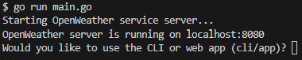
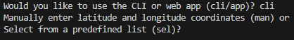

# Open Weather Service

## Description
A HTTP server and client that uses the Open Weather API to get the weather conditions from a given set of coordinates. It summarizes the weather conditions outside of the location (snow, rain, etc) and whether it’s hot, cold, or fair outside.

The API can be found here: https://openweathermap.org/api.

## Features Used
Features: interfaces, goroutines, pointers, structs, servers, clients, HTTP requests/responses, Github Actions, and API calls.

Go Packages: io, bufio, os, strings, time, strconv, http/net, encoding/json, errors, and bytes.


## Running the Application
**NOTE**: There is only one way to run the application at present. The web application and cli too are still in development.

### Prequisites
* Go version 1.xx or above is installed.
* Using a Windows machine. Linux or Mac OS machine hasn't been tested but should work with appropriate environment variables set.

### Setting Up Environment Variables
To make successful calls to the Open Weather API, you'll need an Open Weather API Key. To create a key follow these [instructions](https://openweathermap.org/api/one-call-3#start). Then, create a **config.env** file in the root directory and replace "your_open_weather_api_key" with your key.
```
OW_API_KEY="your_open_api_key"
```

### Running main.go:
1. Navigate to the root directory of this repository in your terminal and run main.go
```go
go run main.go
```
2. Next, there should be text that asks if you would like to use the cli or web app. 

    NOTE: The web app is still in development and is not usable.

    

3. Then, you will see another prompt that asks if you want to manually (man) enter coordinates or select (sel) from a predefined list of places.
    
    

#### Running the web application:
    - *Still in development*.

#### Running the CLI
    - *Still in development*.

## CI/CD
Uses GitHub Actions to support CI/CD. A rudemintary implementation is setup but will be updated in future releases.

## Improvements
- Implement a PostgreSQL as a persistent database to store weather responses.
- Implement as a command line tool using Cobra.
- Implement a local web application interface using GoogleMaps API, JavaScript, React, and HTML5.